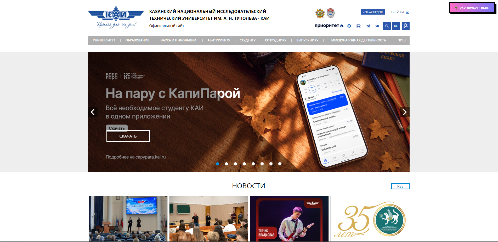
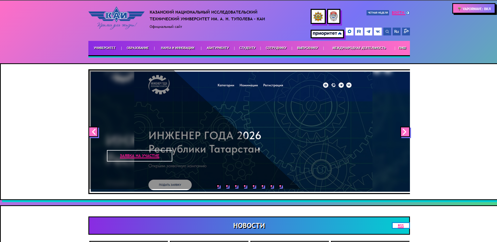

# KAI Vaporwave Style Plugin

Расширение для браузера, меняющее стиль сайта КАИ (kai.ru) на эстетику Vaporwave.

## Инструкция по запуску
1. Откройте `chrome://extensions/` и включите "Режим разработчика".
2. Нажмите "Загрузить распакованное расширение" и выберите папку `style-plugin`.
3. Откройте сайт kai.ru и нажмите кнопку в правом верхнем углу.

## Демонстрация

## Соответствие требованиям
- Использованы: `getElementById`, `querySelector`, `querySelectorAll`, `parentElement`, `children`.
- Сложный селектор: `div.box_links`.
- Изменено более 8 CSS-свойств.
- Реализовано сохранение состояния через `localStorage`.