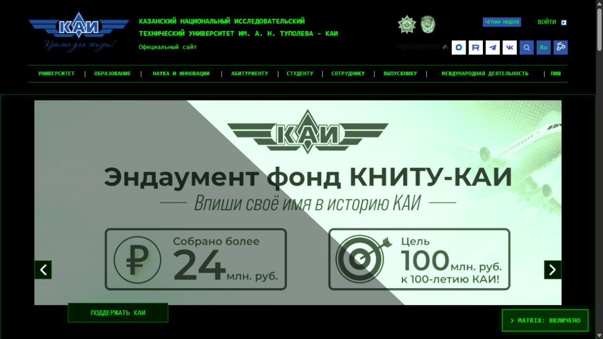

# KAI Terminal / Matrix

Лабораторная работа №2 по JavaScript и DOM. Студент №13, вариант №4.

Расширение для Google Chrome и Яндекс Браузера меняет оформление сайта
[kai.ru](https://kai.ru/) в стиле терминала: чёрный фон, зелёный текст
`#00ff00`, моноширинный шрифт Consolas / Courier New и зелёные рамки.

## Возможности

- На страницах сайта появляется кнопка в правом нижнем углу.
- Кнопка показывает состояние: `MATRIX: ВКЛЮЧЕНО` или `MATRIX: ВЫКЛЮЧЕНО`.
- Нажатие включает тему или возвращает исходное оформление.
- Состояние сохраняется в `localStorage` с ключом `kai-matrix-enabled`.
- После перезагрузки и при переходе на другую страницу того же домена тема восстанавливается.
- Кнопка доступна с клавиатуры: Tab для выбора, Enter или пробел для переключения.
- Если хранилище недоступно, переключение продолжает работать в текущей странице.

В область действия расширения входят `https://kai.ru/*` и `https://www.kai.ru/*`.
Поддомены, например `abiturientu.kai.ru`, не входят в область действия.
Настройка хранится отдельно для каждого домена, поскольку используется хранилище сайта.

## Запуск

1. Откройте в Chrome `chrome://extensions`, в Яндекс Браузере — `browser://extensions`.
2. Включите «Режим разработчика».
3. Нажмите «Загрузить распакованное расширение».
4. Выберите папку `lab2-dom/solutions/student-13/style-plugin` целиком: в ней должен быть `manifest.json`.
5. Откройте или перезагрузите [главную страницу КАИ](https://kai.ru/).
6. Нажмите кнопку `MATRIX: ВЫКЛЮЧЕНО` в правом нижнем углу.
7. Откройте [страницу «Университет»](https://kai.ru/university) из навигации: тема должна остаться включённой.

Устанавливать npm-пакеты и запускать сборку не требуется.
После изменений файлов обновите расширение кнопкой перезагрузки на странице
расширений, затем перезагрузите открытые страницы сайта.

## Изменения оформления

Изменяется более восьми свойств оформления самого сайта:

| Свойство | Результат в режиме Matrix |
| --- | --- |
| Цвет фона страницы и основных блоков | Чёрный `#000000` |
| Цвет текста | Зелёный `#00ff00` |
| Семейство шрифта | Consolas / Courier New / monospace |
| Фоновые изображения оболочки | Убраны фоновые текстуры |
| Цвет ссылок при наведении | Светло-зелёный `#baffba` |
| Оформление ссылок | Подчёркивание при наведении и фокусе |
| Межбуквенный интервал заголовков | Увеличен до `0.08em` |
| Тень заголовков | Зелёное свечение |
| Рамки меню, заголовков и панелей | Зелёные линии |
| Внутренние отступы панелей | `12px` |
| Скругления панелей и элементов управления | Прямые углы |
| Тень панелей | Слабое внутреннее зелёное свечение |
| Фон кнопок и полей ввода | Тёмно-зелёный |
| Цвет курсора в полях ввода | Зелёный |
| Фильтр изображений | Зелёный монохромный оттенок |
| Цвет выделения текста | Зелёный фон и чёрный текст |
| Раскладка карточек «Открой КНИТУ-КАИ» | Flex-ряд с промежутками и переносом |
| Фон активной вкладки стратегических проектов | Тёмно-зелёный с зелёной рамкой |

Изображения и содержимое страниц сохраняются. Изменения стилей сайта
действуют только при наличии класса `kai-matrix` у корневого элемента `html`.
Выключение темы снимает этот класс, поэтому исходные CSS-правила сайта снова действуют.

## Структура и работа кода

- `manifest.json` — Manifest V3, адреса сайта и подключение файлов. Дополнительные разрешения не запрашиваются.
- `content.js` — CSS внутри строки, создание кнопки, обработка клика, сохранение состояния и работа с DOM. Стили добавляются на страницу через элемент `style`.
- `images/` — скриншоты результатов.

Все обязательные способы работы с DOM используются в `content.js`:

| Способ | Для чего используется |
| --- | --- |
| `getElementById` | Проверяет, создана ли кнопка, чтобы избежать дубликатов |
| `querySelector` | Находит список основного меню по сложному селектору `.menu .menu-list` |
| `querySelectorAll` | Находит панели по сложному селектору `.portlet .portlet-content` |
| `parentElement` | Получает контейнер списка меню и добавляет класс оформления |
| `children` | Перебирает непосредственные пункты меню и добавляет классы оформления |

Случайные ID сайта не используются. Отсутствие меню или панелей на конкретной
странице не мешает созданию кнопки. Код начинается с `'use strict';`,
использует `const` и `let` вместо `var`, не содержит импортов и подключения модулей.

## Примеры

Скриншоты получены на локальных копиях текущего DOM главной страницы и страницы
«Университет» от 30 сентября 2026 года с подключёнными исходными стилями сайта
и файлами этого решения. Они показывают результат работы CSS и скрипта;
загрузку расширения через менеджер Chrome / Яндекс Браузера следует проверить отдельно.

### Главная страница, тема выключена

### Главная страница, тема включена

### Новостные карточки главной страницы

### Страница «Университет», тема включена

### Карточки «Открой КНИТУ-КАИ»

Тёмные подписи и flex-ряд с промежутками. На узком экране карточки переносятся.

## Проверка перед сдачей

1. Загрузите папку как распакованное расширение. Убедитесь, что менеджер расширений не сообщает об ошибках.
2. На главной включите тему: проверьте фон, текст, шрифт, ссылки, рамки и статус кнопки.
3. Перезагрузите страницу: тема и статус должны сохраниться.
4. Перейдите через навигацию на страницу «Университет»: проверьте тему и работу переключателя.
5. Выключите тему: исходное оформление должно вернуться. Перезагрузите страницу: режим остаётся выключенным.
6. Проверьте консоль DevTools на обеих страницах: ошибок из `content.js` быть не должно.
7. Проверьте кнопку клавишами Tab и Enter.

Проверка на локальных копиях DOM подтвердила 16 изменений CSS-свойств,
переключение клавишами Enter и пробел, сохранение включённого и выключенного
режимов после перезагрузки и восстановление проверенных исходных стилей.
Также проверены вторая страница, повторный запуск без дублирования кнопки
и стилей, отсутствие меню и панелей, недоступность хранилища и запуск после
готовности DOM. Ошибок скрипта в этих проверках не обнаружено.

Дополнительно проверена копия DOM страницы «Контакты»: форма, список
подразделений и таблица имеют тёмный фон. После выключения темы их исходные
фоны восстанавливаются. Светлые фоны в этих блоках задаёт сам сайт, в том числе
через inline-стили; расширение переопределяет их только при включённой теме.
