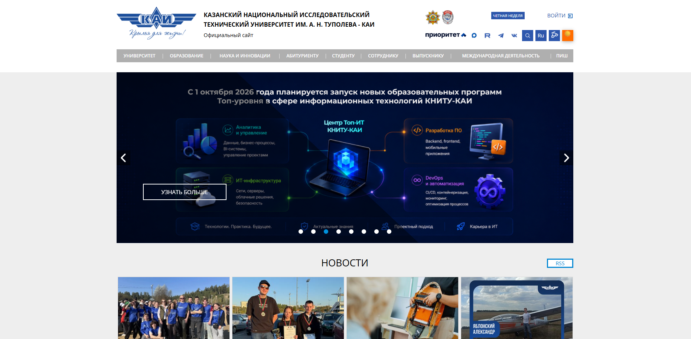
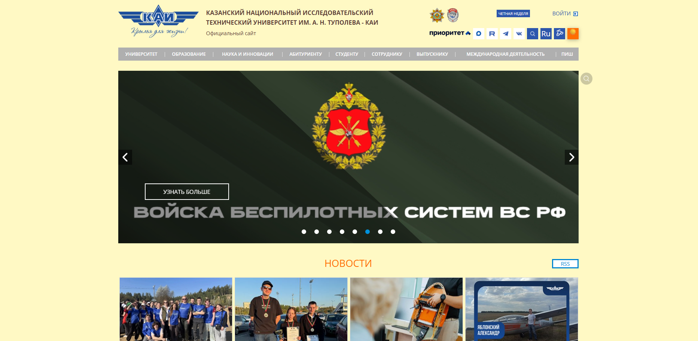

# KAI to SUMMER

Расширение для браузера Google Chrome, добавляющее на сайт `kai.ru`
кнопку переключения летнего (яркого) режима.

## Вариант

**Summer — Лето.** Ярко-жёлтый фон (#fff9c4), оранжевые заголовки (#ff6d00).

## Установка

1. Откройте `chrome://extensions`.
2. Включите «Режим разработчика».
3. Нажмите «Загрузить распакованное расширение».
4. Выберите папку с проектом.

## Использование

1. Перейдите на любую страницу `https://kai.ru/*`.
2. В панели ссылок (`box_links`) появится кнопка ☀️.
3. Нажмите на неё, чтобы включить/выключить летний режим.

## Скриншоты

### До включения режима

### После включения режима

## Структура проекта

- `manifest.json` — манифест расширения (Manifest V3).
- `content.js` — скрипт, добавляющий кнопку и логику переключения.
- `images/` — примеры результатов работы расширения.