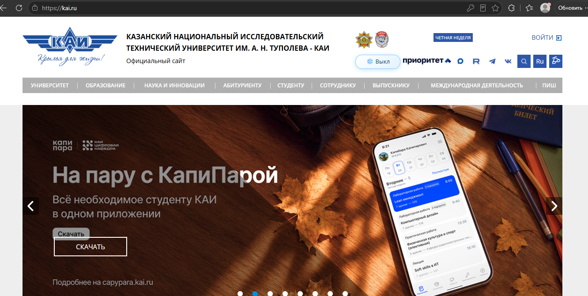
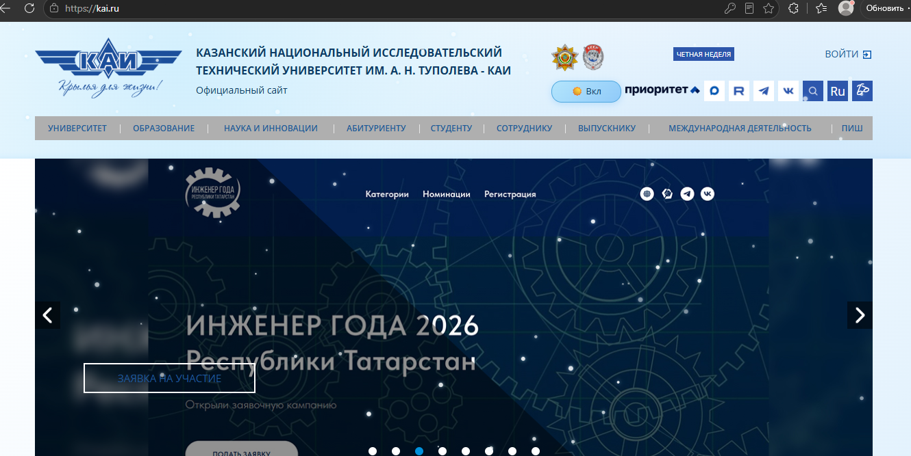

# Расширение для браузера Chrome

Добавляет кнопку для изменения стиля сайта kai.ru
# Winter Theme ❄️

Браузерное расширение (Manifest V3), которое добавляет на сайт
[kai.ru](https://kai.ru) кнопку переключения **зимней темы**:
белый фон, синий текст, снежный градиент, ледяные акценты.

## Возможности

- Кнопка переключения темы на главной странице и на страницах навигации.
- Отображение текущего статуса: `❄️ Выкл` / `☀️ Вкл`.
- Сохранение состояния в `localStorage` — тема не сбрасывается при перезагрузке.
- Работает минимум на **главной** и на **одной странице из навигации**.
- Изменено **более 8 стилей**: фон, цвет текста, размер шрифта, границы,
  тени, радиусы, отступы, hover-эффекты.
- В коде используются: `getElementById`, `querySelector`, `querySelectorAll`,
  `parentElement`, `children`.
- Сложный CSS-селектор:
  `.news_box.dark-mode-active .news_item, .news_box.dark-mode-active a`.

## Установка и запуск

1. Открой `chrome://extensions/`.
2. Включи **Режим разработчика** (правый верхний угол).
3. Нажми **Загрузить распакованное расширение**.
4. Выбери папку `style-plugin`.
5. Открой [https://kai.ru](https://kai.ru) и нажми F5.
6. В шапке сайта появится кнопка **❄️ Выкл**.
7. Нажми её — тема включится, кнопка сменится на **☀️ Вкл**.
8. Перезагрузи страницу — тема сохранится.

## Примеры

### До включения темы

### После включения темы

## Соответствие требованиям

| Требование | Где реализовано |
| Кнопка на главной | `content.js → createToggleButton()` |
| Переключение стиля по клику | `toggleWinterTheme()` |
| Отображение статуса | `updateButtonState()` + `data-status` |
| Сохранение в localStorage | `toggleWinterTheme()` / `restoreState()` |
| Работа на 2+ страницах | `manifest.json → matches` |
| getElementById | `getPageElements()` |
| querySelector | `getPageElements()` |
| querySelectorAll | `getPageElements()` |
| parentElement | `enableWinterTheme()` |
| children | `createToggleButton()` |
| Сложный селектор | `COMPLEX_SELECTOR` + CSS |