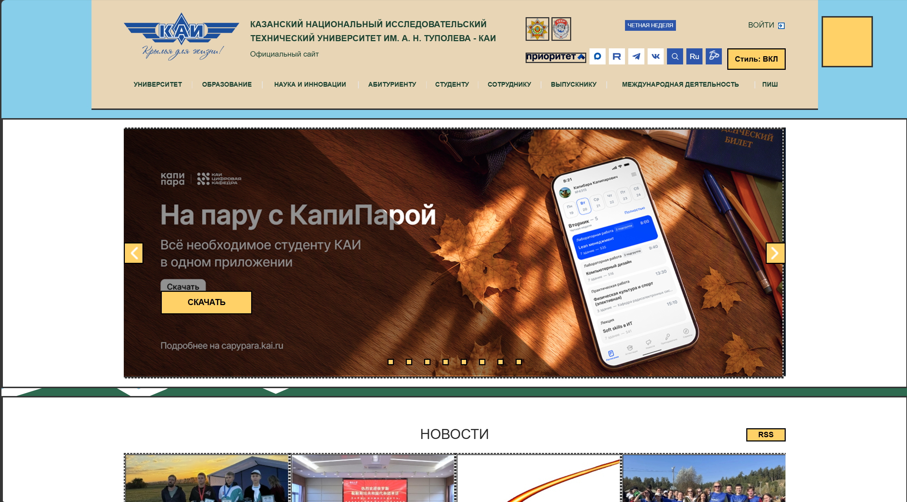
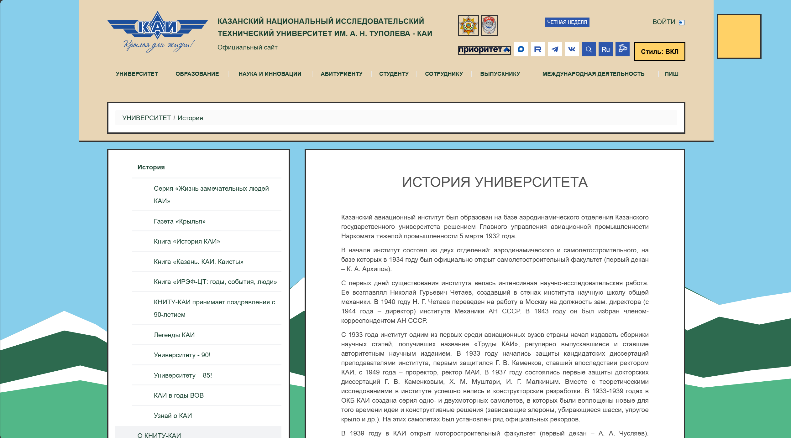

# Расширение для браузера Chrome

Добавляет кнопку для изменения стиля сайта kai.ru

## Подключение расширения

Для подключения потребуется в браузере перейти во вкладку управление расширениями и включить режим разработчика. Далее в параметрах разработчика Загрузить распакованное-Выбрать папку [style-plugin](../style-plugin)-Включить расширение.

## Примеры вида сайта kai.ru с данным расширением

Главная страница

Страница из навигации
