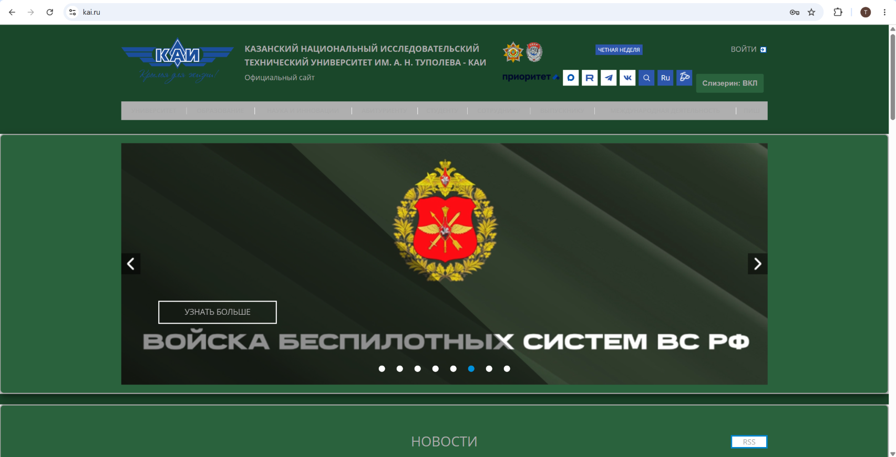

# KAI Slytherin Theme

Плагин для изменения стиля сайта kai.ru.

## Особенности
- Изменение цветовой палитры.
- Кнопка переключения статуса темы.
- Сохранение состояния при перезагрузке страниц (localStorage).
- Работает на главной и внутренних страницах сайта.

## Технические детали
- Использованы методы: getElementById, querySelector, querySelectorAll, parentElement, children.
- Использован сложный селектор.
- Управление стилями осуществляется через добавление/удаление CSS-классов.

## Инструкция по запуску
1. Откройте браузер и перейдите на страницу расширений (`chrome://extensions/`).
2. Включите "Режим разработчика" в правом верхнем углу.
3. Нажмите кнопку "Загрузить распакованное расширение".
4. Выберите папку с файлами проекта.
5. Перейдите на сайт https://kai.ru/ и проверьте работу расширения.

## Примеры результатов (Скриншоты)
В папке `images` находятся скриншоты работы расширения.

