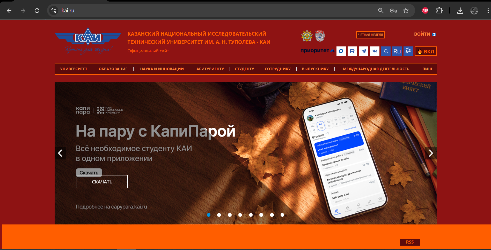
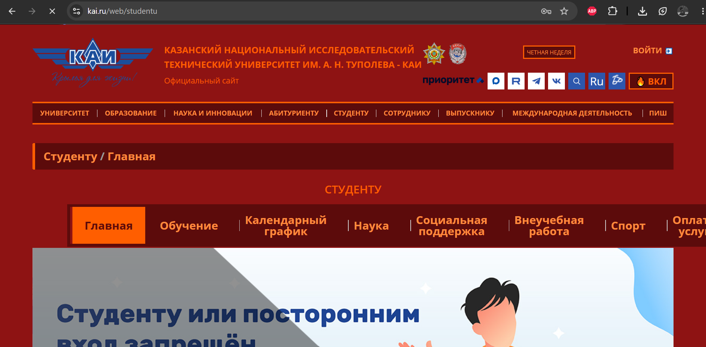

# Лабораторная работа №2

## Описание проекта

Браузерное расширение для сайта kai.ru с оформлением в стиле «Огонь (Народ Огня)» (26 вариант).

Расширение изменяет цвета и стили элементов сайта с помощью JavaScript и DOM. Добавлена кнопка `🔥 ВКЛ / 🔥 ВЫКЛ`.

Состояние режима сохраняется через localStorage.

## Инструкция по запуску

1. Открыть Chrome.
2. Перейти в раздел расширений: `chrome://extensions/`.
3. Включить режим разработчика.
4. Нажать «Загрузить распакованное расширение».
5. Выбрать папку с проектом.
6. Открыть `https://kai.ru/`.
7. Обновить страницу.
8. Нажать `🔥 ВЫКЛ` для включения огненного режима.

## Примеры работы

### img1 — kai.ru

### img2 — kai.ru/web/studentu

