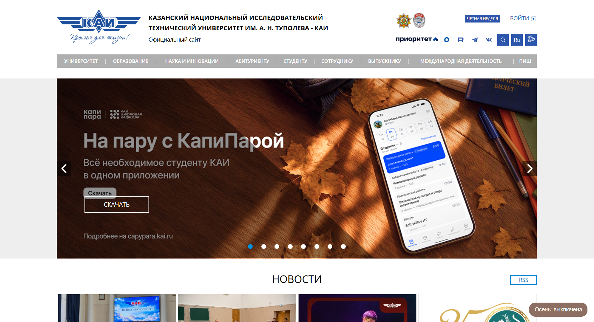
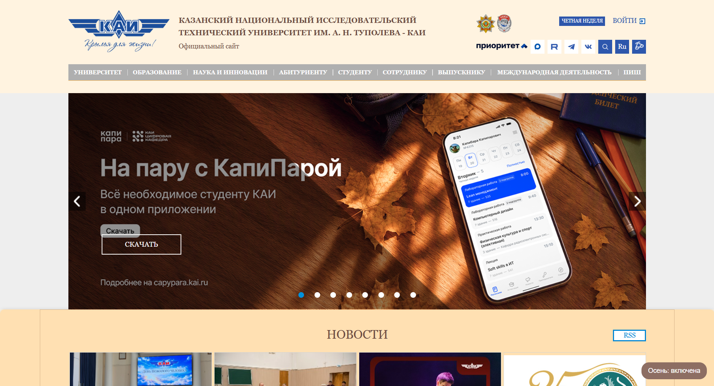
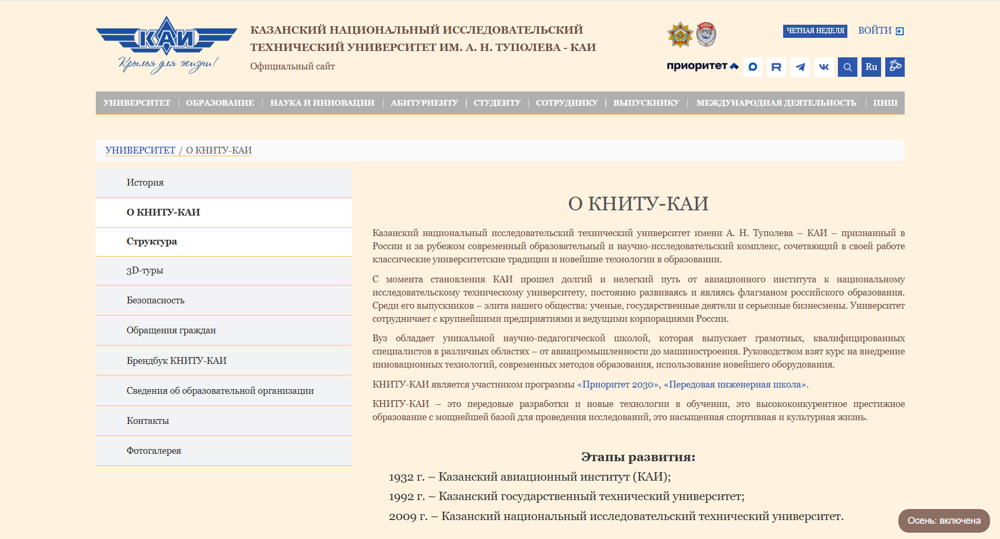

# KAI Autumn

Расширение для Google Chrome (Yandex Browser), которое меняет стиль сайта kai.ru на осеннюю тему: фон цвета охры (#fff3e0) и коричневый текст (#6d4c41). Кнопка в правом нижнем углу включает и выключает тему и показывает статус. Статус сохраняется после перезагрузки страницы.

## Запуск

1. Откройте `chrome://extensions` (в Яндекс Браузере — `browser://extensions`).
2. Включите «Режим разработчика».
3. Нажмите «Загрузить распакованное расширение» и выберите папку проекта.
4. Откройте https://kai.ru и нажмите кнопку «Осень: выключена».

## Примеры

Тема выключена:

Тема включена:

Внутренняя страница:

