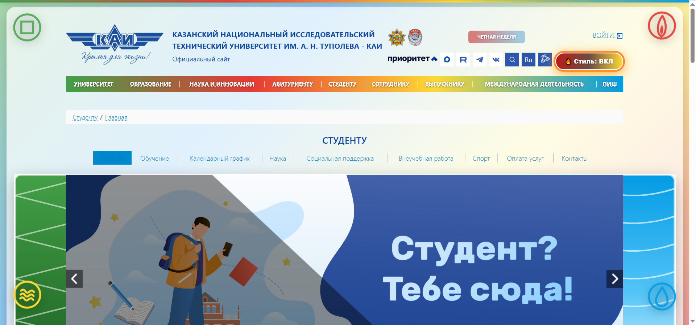
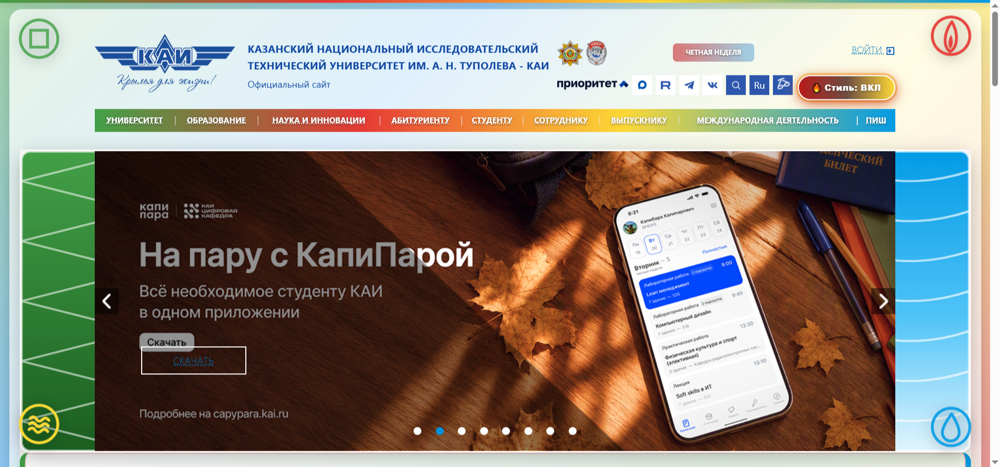

# KAI Avatar Theme — Four Elements

Расширение для Google Chrome / Yandex Browser, которое включает светлую
«медитативную» тему на сайте kai.ru. Тема объединяет четыре стихии
в плавных градиентах: синий (вода), зелёный (земля), красный (огонь),
жёлтый (воздух).

## Установка

1. Открой `chrome://extensions/`.
2. Включи «Режим разработчика» (тумблер в правом верхнем углу).
3. Нажми «Загрузить распакованное расширение».
4. Выбери папку `style-plugin`.

## Использование

- Открой https://kai.ru/
- В шапке появится кнопка «🌪 Стиль: ВЫКЛ».
- Нажми — включится тема, кнопка станет «🔥 Стиль: ВКЛ».
- Статус сохраняется в `localStorage` и восстанавливается после перезагрузки.
- Тема работает на главной странице и на страницах из навигации.

## Скриншоты

**Примеры оформления**

## Структура

- `manifest.json` — описание расширения (Manifest V3)
- `content.js` — логика: кнопка, тема, работа с DOM, localStorage
- `images/` — скриншоты «до» и «после»
- `readme.md` — этот файл