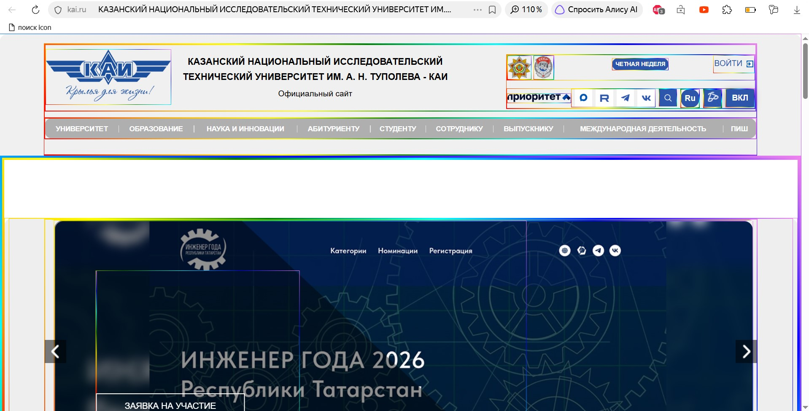
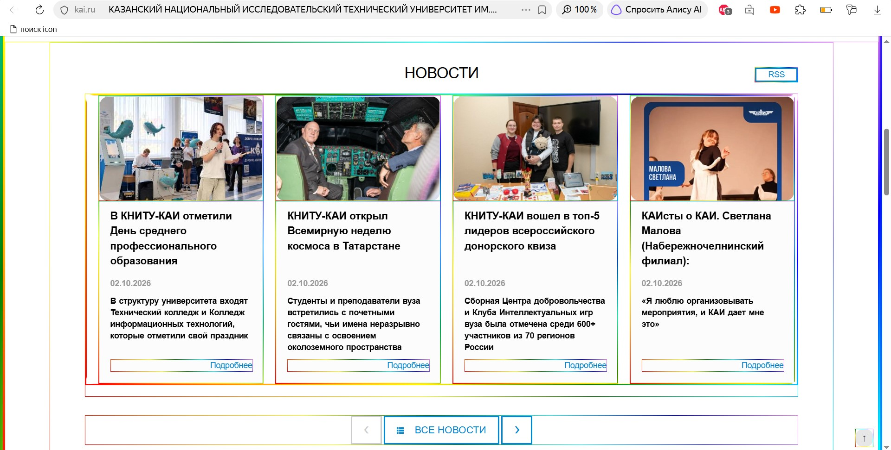
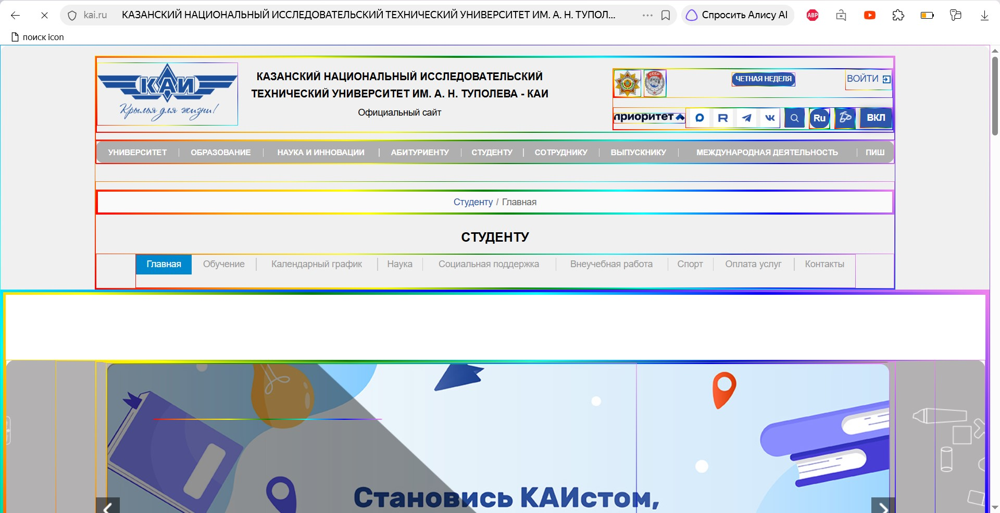

### Rainbow Borders — Радужная рамка у всех изображений и блоков (многоцветный border/border-image).

Расширение, которое добавляет радужную рамку всем div и img элементам на странице, а также применяет дополнительные стили.
Управление стилями реализовано через добавление/удаление заранее определенных классов.

Для установки такого расширения, необходимо:
1. Клонировать репозиторий.
```bash 
git clone https://github.com/shhadel/js_6310_labs_2026.git
```
2. Открыть страницу управления расширениями. Например chrome://extensions/
3. Включить режим разработчика.
4. Нажать на "Загрузить распакованное расширение".
5. Выбрать папку "style-plugin"
6. Готово. Открыть kai.ru, кнопка изменения стилей расположена справа сверху, рядом с кнопкой режима для слабовидящих.



