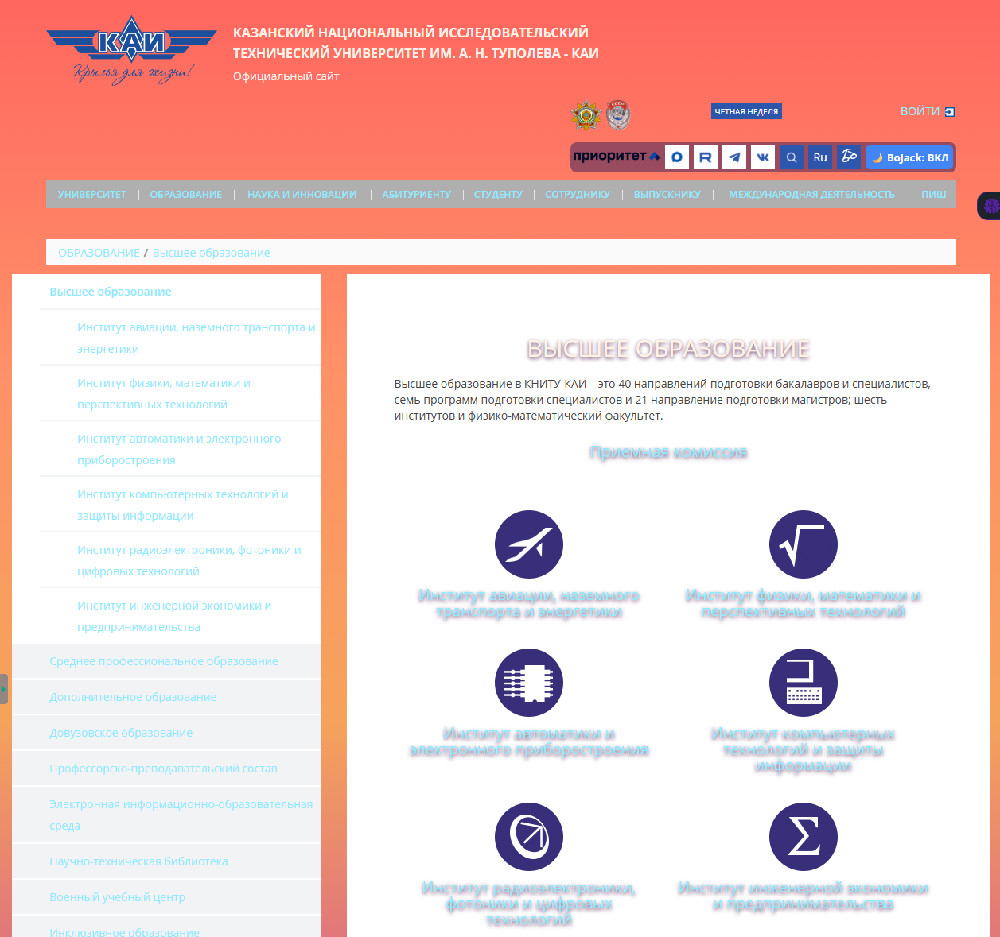

# Расширение для браузера Chrome

# KAI — BoJack Hollywood Style

Chrome/Yandex Browser расширение, изменяющее оформление сайта kai.ru
в стилистике голливудского заката.

## Возможности

- включение и выключение стиля;
- сохранение состояния через localStorage;
- изменение цветов, фонов, границ, отступов и теней;
- работа на главной странице и страницах навигации.

## Установка

1. Скачать репозиторий.
2. Открыть `chrome://extensions/`.
3. Включить «Режим разработчика».
4. Нажать «Загрузить распакованное расширение».
5. Выбрать папку проекта.
6. Открыть `https://kai.ru/`.

## Результат

### До

### После

### Ещё одна страница

