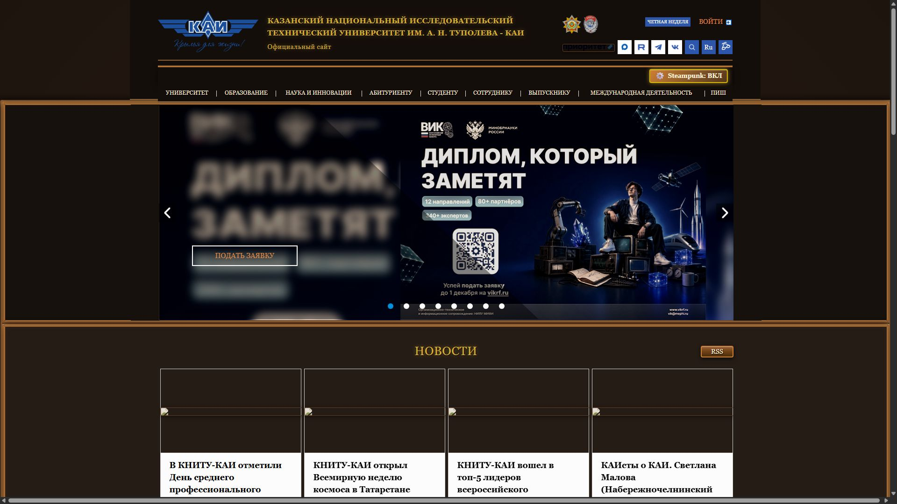
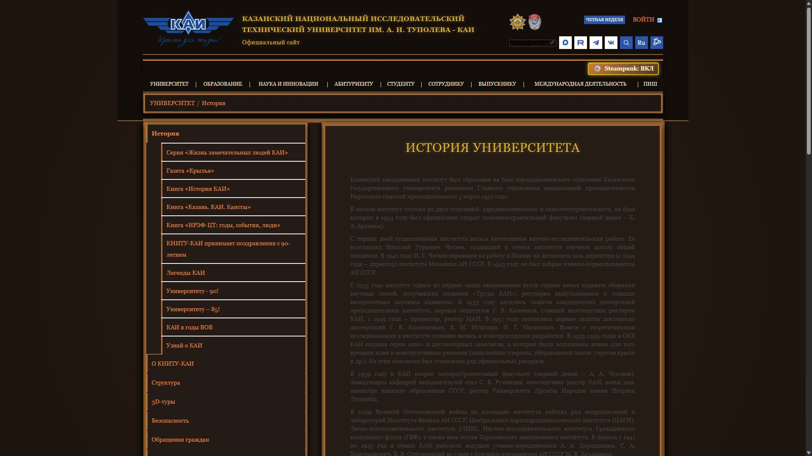

# Лабораторная работа №2: Расширение стиля для сайта kai.ru
## Вариант 15: Steampunk / Victorian Machinery (Стимпанк и викторианская эстетика)

## Описание проекта
Данное браузерное расширение (плагин) для Google Chrome и Яндекс.Браузера модифицирует визуальный стиль официального сайта КНИТУ-КАИ (`kai.ru`) в соответствии с **Вариантом 15: Steampunk / Victorian Machinery**.

Тематика оформления — **«Машины и пар»**:
- **Тёплые металлические тона:** благородная тёмная патина чугуна (`#1a130f`, `#251c16`), полированная латунь и античное золото (`#d4af37`), тёплая медь (`#e08544`, `#cd7f32`).
- **Викторианские рамки:** двойные контуры блоков, барельефные фаски (`outline` со смещением и рельефный `border`), глубокие тени с медным внутренним свечением.
- **Шестерёнки и машинные элементы:** кнопка переключения с анимированной шестерёнкой (`⚙️`), стилизованные под медные пластины кнопки с заклепками и градиентами.
- **Винтажная типографика:** викторианские шрифты с засечками (`Georgia`, `Palatino Linotype`, `serif`), золотистое тиснение заголовков (`text-shadow`).
- **Атмосфера дагеротипа:** фотоматериалы и баннеры обработаны мягким сепийно-медным фильтром.

---

## Выполненные требования

### 1. Функциональные требования
- [x] **Кнопка переключения:** на страницу добавлена стилизованная кнопка `⚙️ Steampunk: ВКЛ` / `⚙️ Steampunk: ВЫКЛ`, отображающая актуальное состояние темы.
- [x] **Сохранение состояния:** статус темы сохраняется при перезагрузке страницы и переходе между разделами сайта с помощью `localStorage` (ключ `kai_steampunk_theme_active`).
- [x] **Работа на главной и навигационных страницах:** корректная работа проверена на главной странице (`https://kai.ru/`) и на странице раздела «История университета» (`https://kai.ru/university/history`).

### 2. Нефункциональные требования
- [x] **Изменено более 8 параметров стилей:**
  1. `backgroundColor` (фон страницы, меню, карточек, секций);
  2. `color` (цвет текста под состаренную бумагу и медь);
  3. `fontFamily` (викторианские шрифты с засечками);
  4. `borderColor` (медные и бронзовые окантовки);
  5. `boxShadow` (глубокие тени и металлическое свечение);
  6. `textShadow` (золотистый отблеск заголовков);
  7. `filter` (сепия, контраст и затемнение фотографий);
  8. `outline` и `outlineOffset` (викторианские двойные рамки контентных блоков);
  9. `letterSpacing` (интервал заголовков);
  10. `borderRadius` и `margin`/`padding`.
- [x] **Использование обязательных методов DOM:**
  - `getElementById` — получение `#page_wrapper`, `#steampunk-toggle-btn`, `#access-box`;
  - `querySelector` — выборка блоков `.portlet-content-container`, `header`, `.box_links`;
  - `querySelectorAll` — выборка заголовков, карточек, ссылок, секций;
  - `parentElement` — подъем к родительскому контейнеру структуры портлетов;
  - `children` — обход дочерних элементов родителя через цикл `for`.
- [x] **Использование сложных селекторов:**
  - `div#menu.menu` — составной селектор (тег + id + класс);
  - `.journal-content-article h3, .portlet-content h2, .portlet-boundary h4` — групповой селектор с контекстными потомками;
  - `div.section-wide.slider_box, .institutes_box, .page_holder` — селектор тега с двумя классами и перечислением;
  - `a.kai-btn-block, button.kai-btn-block` — теги с модификаторами классов.
- [x] **Соответствие базовым критериям ревью:**
  - Директива `'use strict'` в первой строке `content.js`;
  - Полное отсутствие ключевого слова `var` (только `const` и `let`);
  - Отсутствие ключевых слов `import` и `require`;
  - Манифест стандарта **Manifest V3** без лишних разрешений;
  - Отсутствие ошибок в консоли браузера.

---

## Инструкция по установке и запуску

### Google Chrome:
1. Запустите браузер и перейдите на страницу расширений: `chrome://extensions/`.
2. В правом верхнем углу активируйте переключатель **«Режим разработчика»** (*Developer mode*).
3. Нажмите кнопку **«Загрузить распакованное»** (*Load unpacked*).
4. Выберите папку проекта: `solutions/style-plugin`.
5. Убедитесь, что расширение **«KAI Steampunk & Victorian Machinery»** появилось в списке и переключатель включен.
6. Перейдите на сайт [https://kai.ru/](https://kai.ru/) (или обновите страницу клавишей `F5`).

### Яндекс.Браузер:
1. Откройте страницу дополнений по адресу: `browser://extensions/` или перейдите в *Меню → Дополнения*.
2. Включите **«Режим разработчика»**.
3. Нажмите **«Загрузить распакованное расширение»** и укажите путь к `solutions/style-plugin`.
4. Откройте сайт [https://kai.ru/](https://kai.ru/) и обновите вкладку.

---

## Использование
1. В верхней навигационной панели (в блоке меню справа) отображается кнопка переключения: `⚙️ Steampunk: ВКЛ` / `⚙️ Steampunk: ВЫКЛ`.
2. Нажмите на кнопку для включения/выключения темы стимпанка. При наведении на кнопку шестерёнка плавно вращается.
3. Состояние стиля запоминается в браузере. Перейдите в любой раздел навигации (например, [История университета](https://kai.ru/university/history)) — тема останется активной.

---

## Примеры результатов работы

### 1. Главная страница (kai.ru)

### 2. Страница раздела навигации (kai.ru/university/history)

