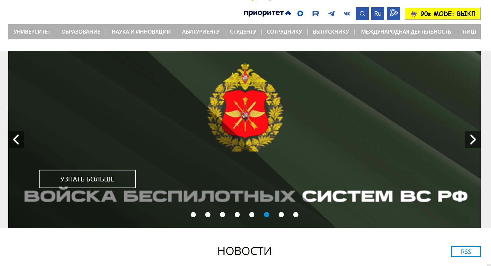
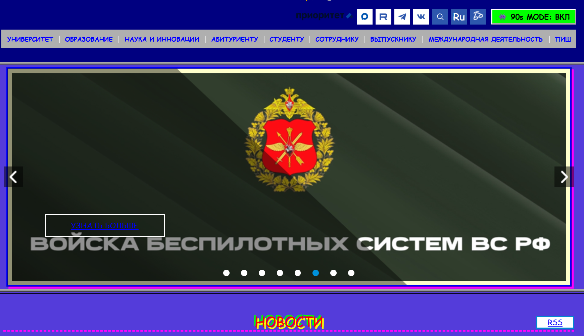

# Kai 90s Mode

Расширение для браузера, которое добавляет на сайт кнопку
переключения стиля в духе 90-х: яркие цвета, Comic Sans,
мигающие заголовки, рамки и тени.

## Возможности

- Кнопка `👾 90s MODE: ВКЛ/ВЫКЛ` в шапке страницы.
- Переключение стиля одной кнопкой.
- Состояние сохраняется между перезагрузками (`localStorage`).
- Стиль применяется на главной и внутренних страницах.
- Изменяется больше 8 CSS-свойств: цвета, шрифты, границы, отступы,
  тени, анимация мигания.

## Установка и запуск

1. Скачайте или склонируйте репозиторий.
2. Откройте в браузере `chrome://extensions/`.
3. Включите **Режим разработчика** (тумблер в правом верхнем углу).
4. Нажмите **Загрузить распакованное расширение**.
5. Выберите папку с проектом (где лежит `manifest.json`).
6. Откройте сайт — в шапке появится кнопка `👾 90s MODE: ВЫКЛ`.
7. Нажмите на кнопку — стиль включится. Перезагрузите страницу — режим
   останется включённым.

## Примеры

| До | После |
|----|-------|
|  |  |

