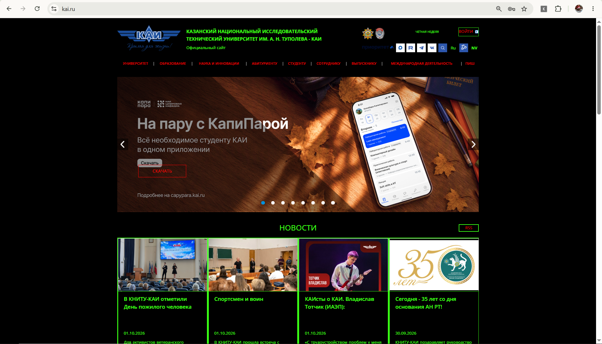
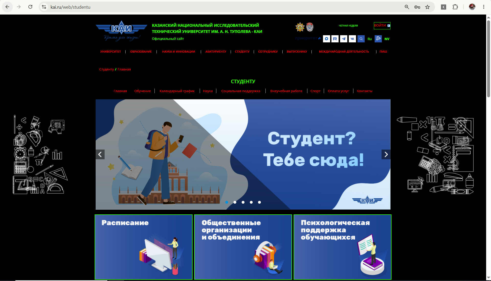

# Расширение: KAI Night Vision Style

## Описание проекта
Данный плагин для браузеров (Google Chrome, Yandex Browser) изменяет оформление всех страниц сайта kai.ru на стиль «Night Vision». 
Цветовая схема:
* Фон: чёрный (`#000000`)
* Текст, рамки, иконки: ярко-зелёный (`#39ff14`)
* Ссылки: красные (`#ff0000`)

На странице появляется кнопка-переключатель статуса, которая сохраняет состояние (вкл/выкл) в `localStorage` и не сбрасывается при переходе по страницам навигации или перезагрузке.

## Технические особенности
* Изменено более 8 CSS-стилей (background, color, border, text-shadow, fill, background-image, border-radius, box-shadow).
* Стили применяются динамически через добавление CSS-класса `night-vision-mode` к тегу `body` (реализован бонус).
* Применены необходимые DOM-методы (`getElementById`, `querySelector`, `querySelectorAll`, `parentElement`, `children`).
* Использованы сложные селекторы (например, `header.header div.container, div.main-wrapper > header`).

## Инструкция по запуску
1. Склонируйте репозиторий или скачайте папку проекта на свой компьютер.
2. Откройте Google Chrome или Yandex Browser.
3. Введите в адресную строку `chrome://extensions/` (или `browser://extensions/` для Yandex).
4. В правом верхнем углу включите Режим разработчика (Developer mode).
5. Нажмите кнопку Загрузить распакованное расширение (Load unpacked).
6. Выберите папку с проектом.
7. Перейдите на сайт [kai.ru](https://kai.ru). В правом верхнем углу появится кнопка управления стилем (NV).

## Примеры результатов (Скриншоты)
В папке `images` находятся скриншоты работы расширения.

