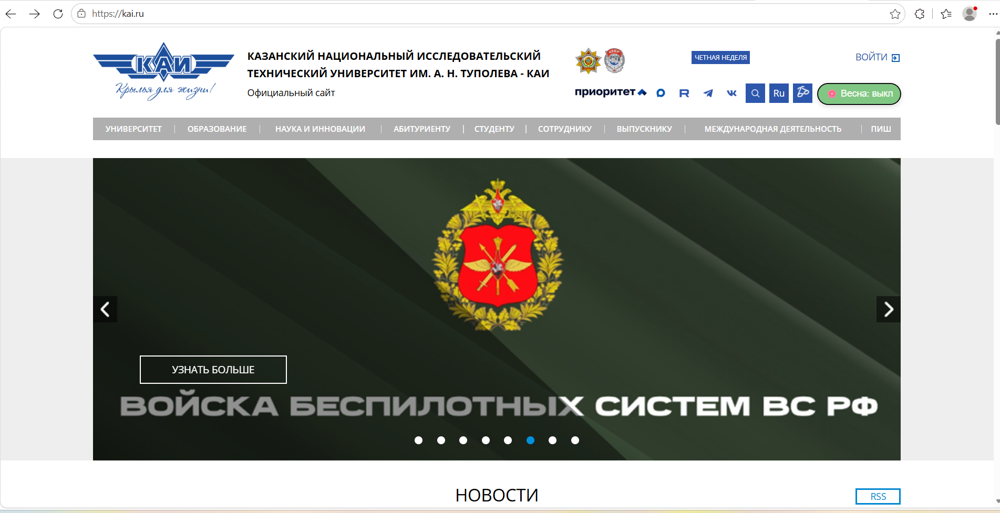

# KAI Spring Theme — расширение для Chrome

Расширение для браузера Chrome, которое добавляет на сайт kai.ru кнопку
включения весенней темы: светло-зелёный фон (#f1f8e9), розовые ссылки
(#ff80ab), цветочные акценты 🌸.

## Возможности

- Кнопка «🌸 Весна» в правом верхнем углу сайта.
- По клику включает/выключает весеннюю тему.
- Статус сохраняется между перезагрузками страницы (localStorage).
- Работает на главной странице kai.ru и на страницах навигации.

## Что меняется в оформлении

- Фон страницы — светло-зелёный `#f1f8e9`.
- Цвет текста — тёмно-зелёный `#2e7d32`.
- Шрифт — Georgia (serif).
- Все ссылки — розовые `#ff80ab`.
- Слайдер — фон `#e8f5e9` с розовой границей снизу.
- Блок новостей — белый фон с розовой границей слева.
- Заголовки — с эмодзи 🌸 в начале.
- Кнопки — закруглённые, розовый фон при включении.

## Установка

1. Откройте Chrome (или Yandex Browser).
2. Перейдите на `chrome://extensions`.
3. Включите **Режим разработчика** (переключатель справа сверху).
4. Нажмите **Загрузить распакованное расширение**.
5. Выберите папку `style-plugin`.
6. Откройте `https://kai.ru` — кнопка «🌸 Весна» появится в правом верхнем углу.

## Использование

- Клик по кнопке — включает или выключает весеннюю тему.
- Статус темы сохраняется при перезагрузке страницы.
- Чтобы отключить расширение: `chrome://extensions` → переключатель.

## Скриншоты

### До

### После

## Структура
