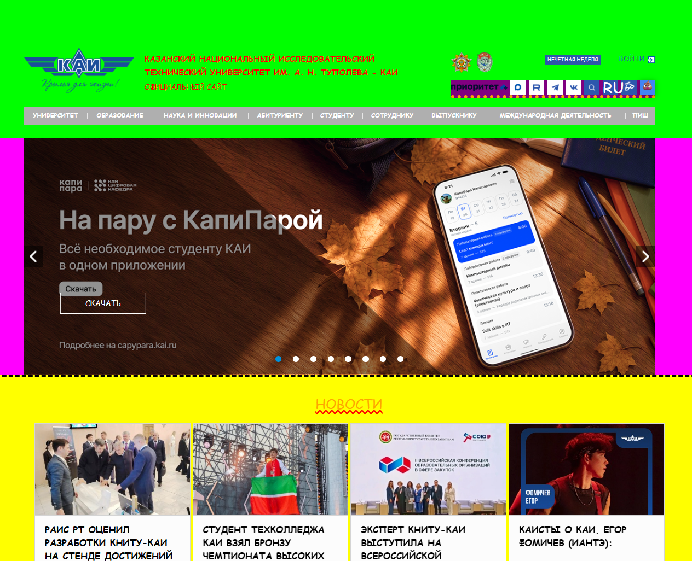

# KAI UGLY MODE

Плагин для Google Chrome (Yandex Browser), который делает сайт **kai.ru** максимально уродливым.

**Вариант 19:** «Настолько плохо, что хорошо» — испортить всё, что можно.

## Что делает

- Добавляет **кнопку 🌙** в шапку сайта `kai.ru`
- По клику **включает/выключает** ужасный режим
- **Статус сохраняется** между перезагрузками (`localStorage`)
- Кнопка **отображает текущий статус**: 🌙 (выключено) / 💩 (включено)

## Как выглядит

### До (обычный сайт)

### После (ужасный режим)

## Что меняется

- **КАПС** — весь текст заглавными
- **Несочетаемые цвета** — красный на лайме, оранжевый на жёлтом
- **Кривые отступы** — `padding: 73px 5px 42px 19px`, `margin-left: 37px`
- **Страшный шрифт** — Comic Sans MS, Impact
- **Кривые рамки** — пунктирные, оранжевые
- **Подчёркивание волнистой линией** — у новостей

## Установка

1. Скачай папку `style-plugin`
2. Открой Chrome → введи `chrome://extensions/`
3. Включи **«Режим разработчика»** (справа вверху)
4. Нажми **«Загрузить распакованное расширение»**
5. Выбери папку `style-plugin`
6. Открой `kai.ru` → появится кнопка 🌙 в шапке

## Использование

1. Открой `kai.ru`
2. Нажми **🌙** → сайт станет уродливым, кнопка → 💩
3. Нажми **💩** → вернётся обычный вид, кнопка → 🌙
4. **Перезагрузи** страницу — статус сохранится

## Технологии

- **Manifest V3** — современный формат расширений Chrome
- **JavaScript (DOM API)**:
  - `getElementById`
  - `querySelector`
  - `querySelectorAll`
  - `parentElement`
  - `children`
  - Сложные селекторы (`header .box_links`)
- **localStorage** — для сохранения статуса
- **CSS-стили через JS** — прямое изменение `element.style`

## Структура проекта
style-plugin/
├── manifest.json ← паспорт расширения
├── content.js ← основной код
├── README.md ← этот файл
└── images/
├── before.png ← сайт до
└── after.png ← сайт после

**Студент №5**  
Группа: 6310  
Лабораторная работа №2 — DOM