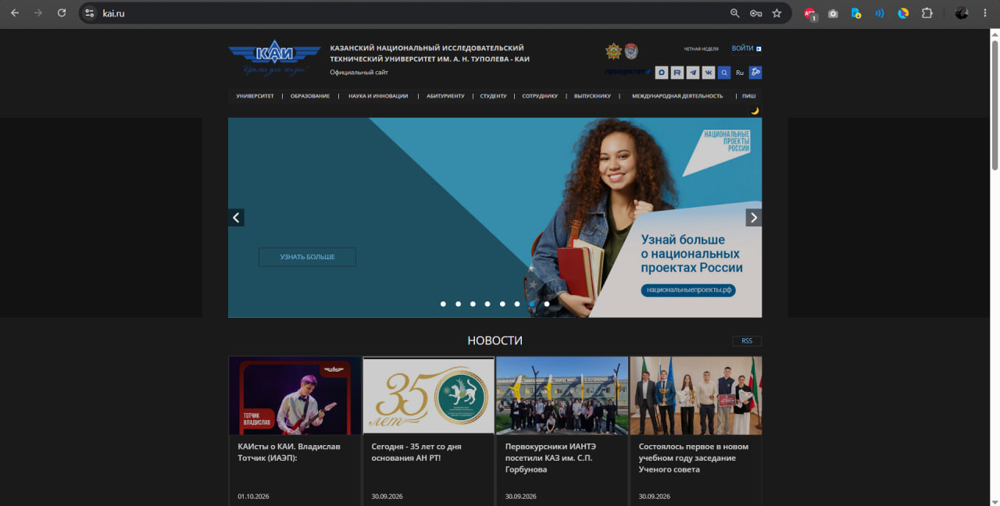
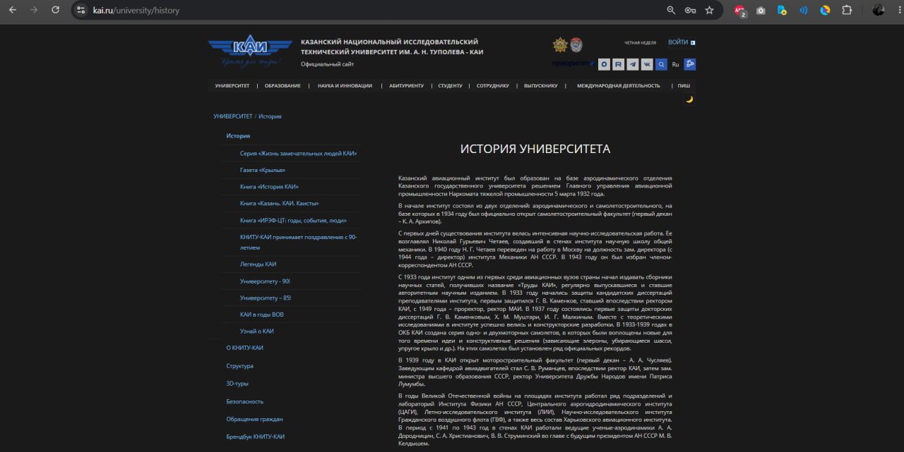

# Dark it Тёмная тема для сайта КАИ (kai.ru)

## Описание проекта
Данное расширение для браузера реализует вариант **"Dark it"** - тёмную тему для вечернего просмотра сайта КНИТУ-КАИ. 

Основные характеристики темы:
- Тёмный фон основного контента (`#121212` и `#1a1a1a`).
- Светлый, комфортный для чтения текст (`#e0e0e0`, `#d0d0d0`).
- Приглушённые акцентные цвета для ссылок и элементов навигации (`#7ab8e0`).
- Сниженная яркость изображений с помощью CSS-фильтров, чтобы тема не «била по глазам».

## Реализованные требования
1. **Функциональные:**
   - Добавлена кнопка переключения стиля, отображающая текущий статус (включен/выключен).
   - Состояние темы сохраняется при перезагрузке страницы с использованием `localStorage`.
   - Тема корректно работает как на главной странице, так и на страницах навигации (например, "История университета").
2. **Нефункциональные:**
   - Изменено более 15 стилей страницы (цвета шрифтов, фоны, границы, отступы, фильтры яркости).
   - В коде использованы требуемые методы DOM: `getElementById`, `querySelector`, `querySelectorAll` (включая сложные селекторы), `parentElement`, `children`.
   - Отсутствует привязка к динамическим ID (используются устойчивые селекторы по классам и вложенности).

## Структура проекта
```text
student-6/
├── style-plugin/          # Папка с исходным кодом расширения
│   ├── manifest.json      # Манифест расширения (Manifest V3)
│   ├── content.js         # Основной скрипт внедрения стилей и логики
│   └── README.md          # Этот файл
└── images/                # Папка с примерами результатов
    ├── example-1_main.jpg     # Скриншот главной страницы
    └── example-2_history.jpg  # Скриншот страницы ("История")
```
## Инструкция по запуску

### Для Google Chrome:
1. Откройте браузер и перейдите по адресу: chrome://extensions/
2. В правом верхнем углу включите переключатель **«Режим разработчика»** (Developer mode).
3. Нажмите кнопку **«Загрузить распакованное расширение»** (Load unpacked).
4. В открывшемся окне выберите папку `style-plugin` (которая находится внутри папки `student-6`).
5. После успешной загрузки расширение появится в списке. Убедитесь, что оно включено.
6. Перейдите на сайт https://kai.ru/ и обновите страницу (F5 или Ctrl+R).

### Для Яндекс.Браузера:
1. Перейдите по адресу: browser://extensions/
2. Включите **«Режим разработчика»**.
3. Нажмите **«Загрузить распакованное расширение»** и укажите путь к папке `style-plugin`.
4. Откройте сайт КАИ и обновите страницу.

## Использование
После установки расширения на сайте (в верхней части, рядом с другими иконками) появится кнопка переключения темы (☀️/). 
- Нажмите на неё, чтобы включить тёмную тему.
- Статус темы автоматически сохраняется. При переходе на другие страницы сайта (например, в раздел "История") тема останется активной.
- Повторное нажатие отключает тему и возвращает стандартный вид сайта.

## Примеры результатов

### Главная страница сайта


### Страница (История университета)
