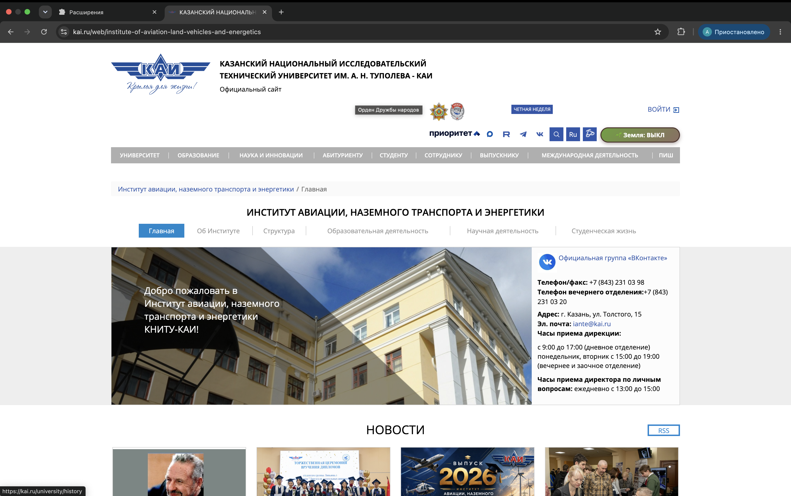
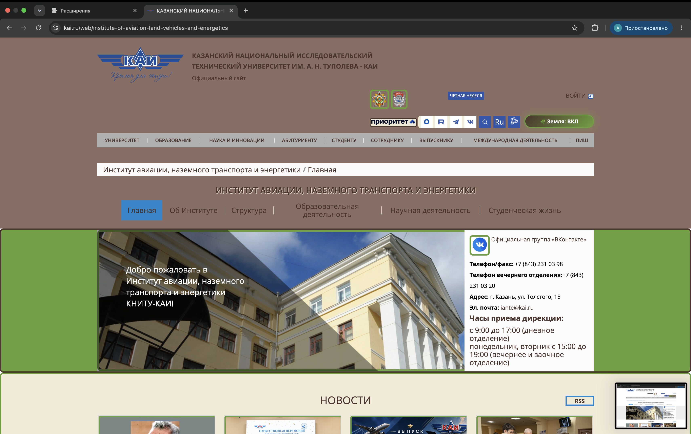

# Расширение для браузера Chrome

## KAI Earth Mode

Расширение изменяет стиль сайта **kai.ru** в соответствии с темой
**«Земля (Царство Земли)»**.

**Вариант 25:** «Земля (Царство Земли)» — прочность, надёжность, природные цвета.

---

## Что делает

- Добавляет **кнопку 🌱** в шапку сайта `kai.ru`
- По клику **включает/выключает** режим «Земля»
- **Статус сохраняется** между перезагрузками (`localStorage`)
- Кнопка **отображает текущий статус**: 🌱 (выключено) / 🌿 (включено)

---

## Палитра «Земля»

| Цвет | HEX | Где используется |
|------|-----|------------------|
| Земляной коричневый | `#8d6e63` | Фон страницы, акценты |
| Тёмно-коричневый | `#4e342e` | Текст, границы, заголовки |
| Травяной зелёный | `#689f38` | Кнопки, ссылки, слайдер |
| Кремовый | `#f1ead7` | Фон карточек, блоков |

Тема передаёт ощущение **прочности**, **надёжности** и **близости к природе**.

---

## Как выглядит

### До (обычный сайт)



### После (режим «Земля»)



---

## Что меняется

- **Фон страницы** — земляной коричневый (`#8d6e63`)
- **Текст** — тёмно-коричневый (`#4e342e`)
- **Слайдер** — зелёный с коричневой рамкой (`#689f38`, `#4e342e`)
- **Блок новостей** — кремовый с зелёной рамкой (`#f1ead7`, `#689f38`)
- **Ссылки** — зелёные, жирные (`#689f38`)
- **Заголовки** — тёмно-коричневые с тенью (`#4e342e`)
- **Картинки** — зелёная рамка (`#689f38`)
- **Меню** — кремовые плашки (`#f1ead7`)
- **Слово «приоритет»** — в рамке
- **Кнопка** — градиент (зелёный → коричневый), скруглённые углы

---

## Установка

1. Скачай папку `style-plugin`
2. Открой Chrome → введи `chrome://extensions/`
3. Включи **«Режим разработчика»** (справа вверху)
4. Нажми **«Загрузить распакованное расширение»**
5. Выбери папку `style-plugin`
6. Открой `kai.ru` → появится кнопка 🌱 в шапке

---

## Использование

1. Открой `kai.ru`
2. Нажми **🌱 Земля: ВЫКЛ** → сайт станет «земляным», кнопка → **🌿 Земля: ВКЛ**
3. Нажми **🌿 Земля: ВКЛ** → вернётся обычный вид, кнопка → **🌱 Земля: ВЫКЛ**
4. **Перезагрузи** страницу — статус сохранится

---

## Технологии

- **Manifest V3** — современный формат расширений Chrome
- **JavaScript (DOM API)**:
  - `getElementById` — поиск элемента по id
  - `querySelector` — поиск по CSS-селектору
  - `querySelectorAll` — поиск всех элементов
  - `classList.add` / `classList.remove` / `classList.toggle` — управление классами
  - `parentElement` — родительский элемент
  - `children` — дочерние элементы
  - Сложные селекторы (`header .box_links`, `#page_wrapper h1`)
- **localStorage** — для сохранения статуса между перезагрузками
- **CSS-стили через JS** — динамическое добавление `<style>` в `<head>`

---

## Структура проекта
```
style-plugin/
├── manifest.json       ← паспорт расширения
├── content.js          ← основной код
├── README.md           ← этот файл
└── images/
    ├── before.png      ← сайт до
    └── after.png       ← сайт после
```
