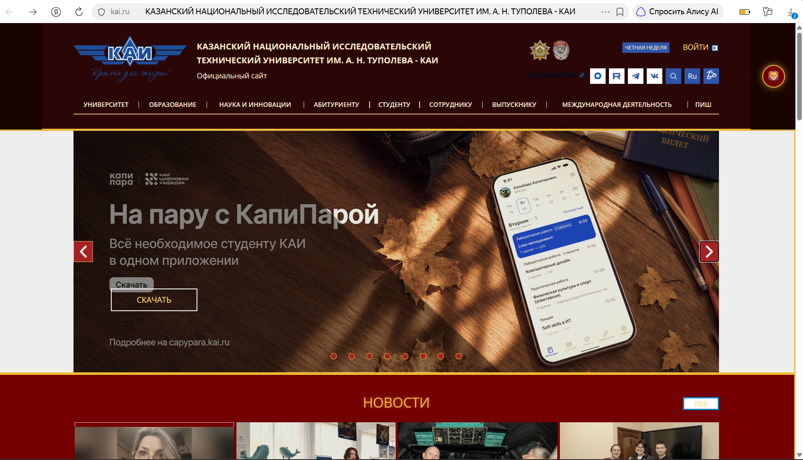
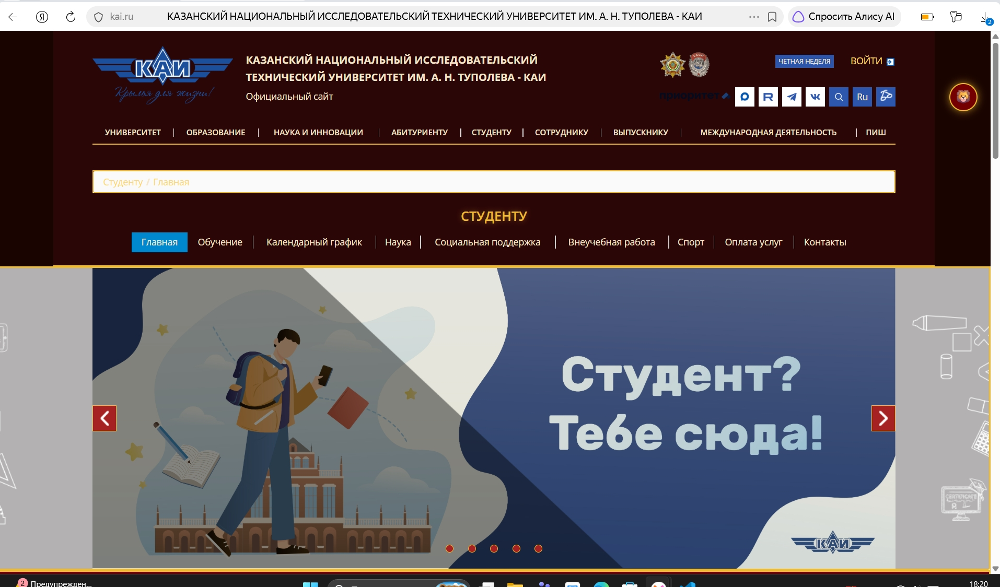

# Гриффиндор для КАИ 🦁

Расширение для Google Chrome / Яндекс.Браузера, которое добавляет 
тёмную тему в цветах факультета Гриффиндор на сайт kai.ru.

## Описание

Тема оформлена в стиле факультета Гриффиндор школы Хогвартс:
- Тёмный фон `#1a0400` и `#2b0606`
- Алые карточки и блоки `#740001`, `#a62122`
- Золотые заголовки и акценты `#eeba30`, `#ffd966`
- Гифка с пламенем в углу экрана 🔥

Тема работает:
- На главной странице `kai.ru`
- На странице навигации `kai.ru/web/studentu`

## Функциональность

- Кнопка 🦁 / ⚡ в правом верхнем углу — включает и выключает тему
- Кнопка показывает текущий статус (включена/выключена)
- Статус сохраняется между перезагрузками через `localStorage`
- Изменено более 10 стилей: фон, цвета шрифтов, границы, отступы, фильтры, кнопки

## Как установить

### Google Chrome
1. Открой `chrome://extensions/`
2. Включи **Режим разработчика** (в правом верхнем углу)
3. Нажми **Загрузить распакованное расширение**
4. Выбери папку `style-plugin`
5. Открой `https://kai.ru` и обнови страницу (F5)

### Яндекс.Браузер
1. Открой `browser://extensions/`
2. Включи **Режим разработчика**
3. Нажми **Загрузить распакованное расширение**
4. Выбери папку `style-plugin`
5. Открой `https://kai.ru` и обнови страницу

## Использование

После установки в правом верхнем углу появится круглая кнопка:
- **⚡** — тема выключена
- **🦁** — тема включена

Нажми на кнопку — тема переключится. Состояние сохранится при перезагрузке.

## Скриншоты

### Главная страница

### Страница «Студенту»
