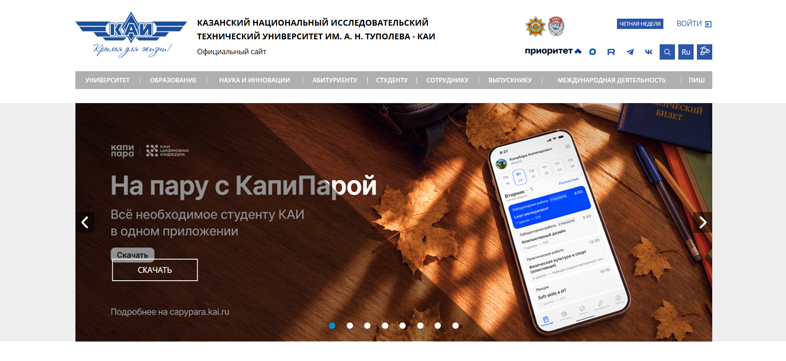
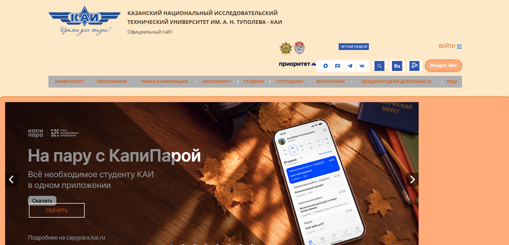

# Плагин "Стиль Воздуха" для сайта КАИ

## Описание
Расширение для Google Chrome / Yandex Browser, которое добавляет на сайт КАИ кнопку переключения фирменного стиля варианта "Воздух" (персиково-кремовые тона: `#fde8c8`, `#ffac7a`). 

Реализованы все требования лабораторной работы:
- Сохранение состояния (вкл/выкл) при перезагрузке через `localStorage`.
- Изменение не менее 8 стилей (фон, цвет текста, границы, отступы, тени и др.) через CSS-классы (бонусное требование).
- Использование требуемых методов DOM: `getElementById`, `querySelector`, `querySelectorAll`, `parentElement`, `children`.
- Наличие сложного селектора (`.box_links > div`).

## Инструкция по запуску
1. Откройте браузер и перейдите по адресу `chrome://extensions/` (или `browser://extensions/` в Яндекс.Браузере).
2. В правом верхнем углу включите переключатель **"Режим разработчика"**.
3. Нажмите кнопку **"Загрузить распакованное расширение"** (Load unpacked).
4. Выберите папку `style-plugin` из этого репозитория.
5. Откройте сайт [kai.ru](https://kai.ru) или любую страницу навигации КАИ.
6. В правом нижнем углу появится кнопка "Стиль Воздуха: Выкл". Нажмите на неё для активации.

## Примеры результатов

*Рисунок 1: Исходный вид страницы*

*Рисунок 2: Вид страницы с активированным стилем "Воздух"*